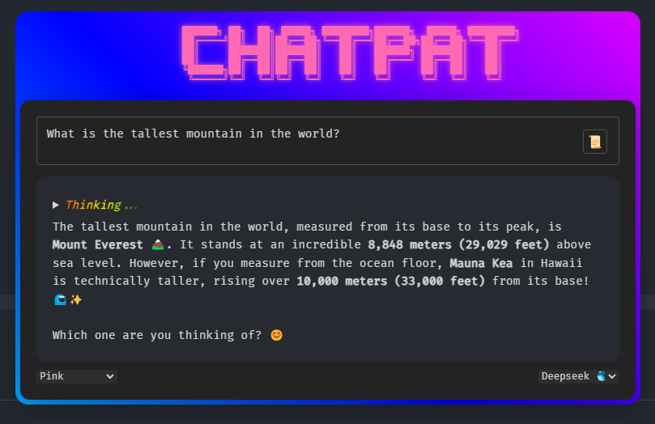

## Overview

ChatPat is an interactive chat application that leverages Groq to provide intelligent, context-aware conversations. Much quicker inferance, assessability and ease-of-use, ChatPat is designed to understand and respond naturally. As someone who just wants to have a quick shortcut key that can answer my question anywhere without using Microsoft Copilot's slow, unintuitive interface or Chatgpt website.

## Features

- 🤖 Powered by Groq LLM fast inferernce
- 💬 Natural conversation interface
- 🚀 Fast and responsive interactions
- 📱 User-friendly design

- Code blocks with language specific synatx highlighting
- Latex support for mathematics  

## Example



## Installation

```bash
# Clone the repository
git clone https://github.com/username/ChatPat.git

# Navigate to the project directory
cd ChatPat

# Install dependencies
npm install

npm init -y

```


## Usage

```bash
# Start the application in development mode
npm start

# Or run the Electron app directly
npx electron .

# Or use the included .bat or .vbs file.
```

### Keyboard Shortcut

- `Ctrl+Alt+I` - Primary way to pop-up and hide the app. Create a new chat.

### Building for Production

```bash
# Build the application for your platform
npm run build

# Or build for specific platforms
npm run build:win    # Windows
npm run build:mac    # macOS
npm run build:linux  # Linux
```

## Contributing

Contributions are welcome! Please feel free to submit a Pull Request.
